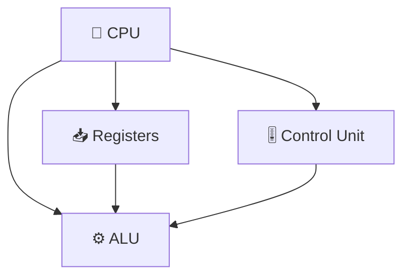
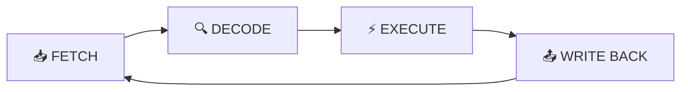
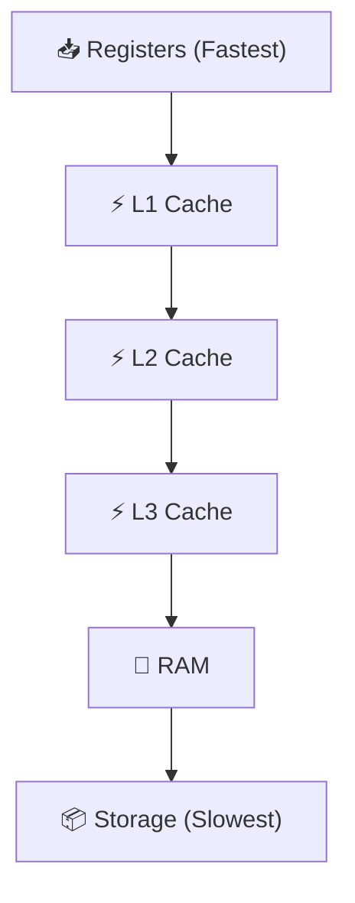
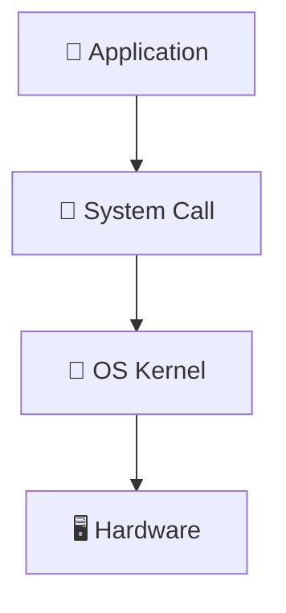
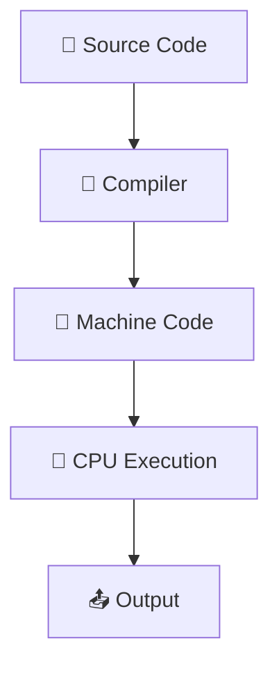

# 📘 **Module 1 — How a Computer Operates & Foundations of Programming**

Understanding how computers *actually* work beneath the surface is the most crucial step before learning any programming language — *especially Java*, which is built upon deep computational concepts like bytecode, stack frames, memory areas, and CPU abstraction.

This module takes you from **electrons → binary → CPU → OS → program execution**, step-by-step.

---

# 🧭 **Table of Contents**

* [⚙️ 1. How a Computer Actually Works](#⚙️-1-how-a-computer-actually-works)

  * [🧠 1.1 CPU Architecture & Internal Components](#🧠-11-cpu-architecture--internal-components)
  * [🔄 1.2 Fetch–Decode–Execute Cycle](#🔄-12-fetchdecodeexecute-cycle)
  * [💾 1.3 Memory Hierarchy & Flow](#💾-13-memory-hierarchy--flow)
  * [🖥️ 1.4 OS & Hardware Interaction](#🖥️-14-os--hardware-interaction)
  * [🚀 1.5 How Programs Actually Run](#🚀-15-how-programs-actually-run)
* [👨‍💻 2. What Programming Really Is](#👨‍💻-2-what-programming-really-is)
* [🗂 3. Types of Programming Languages](#🗂-3-types-of-programming-languages)
* [🧑‍🔧 4. What a Programmer Actually Does](#🧑‍🔧-4-what-a-programmer-actually-does)
* [🗺️ Visual Summaries (Mermaid Diagrams)](#🗺️-visual-summaries-mermaid-diagrams)

---

# ⚙️ **1. How a Computer Actually Works**

Computers aren't “smart.” They just execute billions of simple electrical operations per second with incredible precision.

A computer is fundamentally:

```
Electricity + Binary Logic + CPU + Memory + Operating System
```

Let’s break this down **properly**.

---

# 🧠 **1.1 CPU Architecture & Internal Components**

The CPU is the *command center* of the system.

### 🧩 Components:

* **ALU** (Arithmetic Logic Unit) → Math + logical operations
* **CU** (Control Unit) → Directs execution
* **Registers** → Ultra-fast micro-memory
* **Clock** → Ticks that trigger operations
* **Bus System** → Data movement highway

---

### 🧠 **🛠 CPU Block Diagram**



---

# 🔄 **1.2 Fetch–Decode–Execute Cycle**

**Every program in existence (Java, C, Python, anything)** gets executed through this cycle.

### ⚡ The Cycle:

1. **Fetch** → CPU fetches instruction from memory
2. **Decode** → CPU interprets what to do
3. **Execute** → ALU/CU carries it out
4. **Write-Back** → Result stored in register/memory

### 🔁 **Diagram**



---

# 💾 **1.3 Memory Hierarchy & Flow**

Memory is layered — faster memory is smaller and expensive; slower memory is larger.

### ⏳ **From Fastest → Slowest**

```
📥 Registers  
⚡ L1 Cache  
⚡ L2 Cache  
⚡ L3 Cache  
💾 RAM  
📦 SSD / HDD  
```

### 📐 **Hierarchical Diagram**



---

# 🖥️ **1.4 OS & Hardware Interaction**

The OS is the **manager** that controls hardware, processes, memory, drivers, and applications.

### ⭐ Core Responsibilities:

* 👨‍💼 Process scheduling
* 🧠 Memory allocation
* 🖱 Device & driver management
* 📂 File system management
* 🔐 Security & permissions

### 🧩 **How Apps Talk to Hardware**



---

# 🚀 **1.5 How Programs Actually Run**

When you click a program (let’s say Chrome), this happens:

1. OS loads binary from storage 📦
2. Allocates memory (stack/heap) 💾
3. CPU starts executing instructions ⚡
4. Threads/processes are scheduled 🔁
5. UI is drawn on screen 🖥️

### 🔥 Execution Flow Diagram



---

# 👨‍💻 **2. What Programming Really Is**

Programming is **not** syntax.
Programming is:

* 🧠 *Thinking logically*
* 🧮 *Breaking problems into steps*
* 🗣 *Expressing solutions in a formal language*
* ⚙️ *Controlling CPU + memory indirectly*

> 💡 A program is a structured set of instructions that the CPU executes step-by-step.

---

# 🗂 **3. Types of Programming Languages**

### **By Level**

| Level         | Examples               | Description                           |
| ------------- | ---------------------- | ------------------------------------- |
| 🟣 Low-Level  | Machine Code, Assembly | Hardware-near, fastest                |
| 🔵 Mid-Level  | C                      | Balance between control & abstraction |
| 🟢 High-Level | Java, Python           | Human-friendly                        |

---

### **By Execution Model**

| Type                       | How It Works                      | Examples     |
| -------------------------- | --------------------------------- | ------------ |
| 🔧 Compiled                | Fully converted to machine code   | C, C++       |
| 🔥 Interpreted             | Executed line-by-line             | Python, JS   |
| hybrid Hybrid (Java Model) | Compile to bytecode → VM executes | Java, Kotlin |

---

# 🗺️ **Visual Summaries**

### 📌 **Entire System Workflow**

```
flowchart TD
  A[👆 User Action] --> B[🧩 OS]
  B --> C[📥 Program Loader]
  C --> D[💾 Memory Allocation]
  D --> E[⚙️ CPU Instruction Cycle]
  E --> F[📤 Output]
```

---

